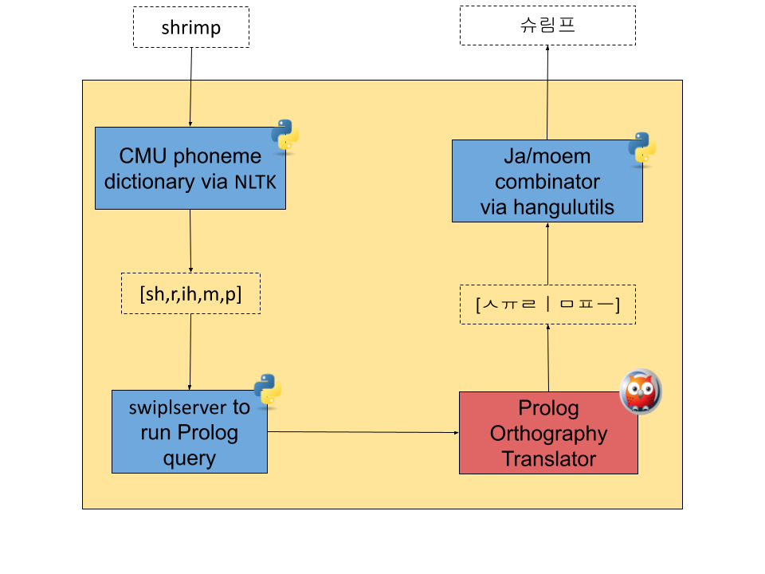

# Konglog: Write your favorite Konglish correctly with Prolog

Final Project for CS579 Computational Linguistics at KAIST, Fall 2021, by Janggun Lee.

## Introduction:
Konglog is an implementation of the [Korean Loanword Orthography](https://kornorms.korean.go.kr/m/m_regltn.do#a) in Prolog and Python. It aims to faifully encode the rules of the orthography, and provide a simple API for all to use.

## Dependencies:

### Python 3
* Install [Python 3](https://www.python.org/downloads/).
* `swiplserver` is tested on 3.7 and above, and NLTK only supports up to 3.9, so get a version in between.

### Prolog

* Install [SWI-Prolog](https://www.swi-prolog.org/Download.html).
* Install [`swiplserver`](https://github.com/SWI-Prolog/packages-mqi/tree/master/python).
* Check the [`swiplserver` docs](https://www.swi-prolog.org/packages/mqi/prologmqi.html) and make sure you set up SWI-Prolog correctly.

### NLTK

* Install [NLTK](https://www.nltk.org/install.html).
* Download the `cmudict` corpus, and run the following Python script. This will download only the nessecary data.

```python
import nltk
nltk.download('cmudict')
```
* If the download doesn't start with `[SSL:CERTIFICATE_VERIFY_FAILED]`, check [this comment](https://github.com/gunthercox/ChatterBot/issues/930#issuecomment-322111087) for a solution.

## API:
Konglog provides a simple function, `eng_to_kong` that takes in a english word as input, and returns the Konglish translation as output. A very simple example is shown below.

```python
import konglog

def main():
    word = "shrimp"

    print(konglog.eng_to_kong(word))
```

For a more complete example, try the script in [`__init__.py`](__init__.py) with `python3 __init__.py`! This will create a CLI where the user can type in words to translate as below.

```
CS579-Project % python3 __init__.py
Welcome to Konglog mini example.
Type an English word you want to translate.
English word, or N to exit: shrimp
Translating to Konglish. This may take a bit...
"shrimp" is translated into "슈림프"

Type an English word you want to translate.
English word, or N to exit: N
Thanks for trying Konglog!
```


## Structure:
Konglog has three main steps in its architecture, depicted in the picture below.


1. First, the input word is translated into phonems by looking up the CMU pronounciation dictionary, provided by NLTK.
2. Second, the phonems are trasnalted into jaem and moems.
3. Finally, the jaem and moems are combined into one. The tools for this combination are in [unicode.py](unicode.py), and is taken from [`hangulutils`](https://github.com/kaniblu/hangul-utils)
